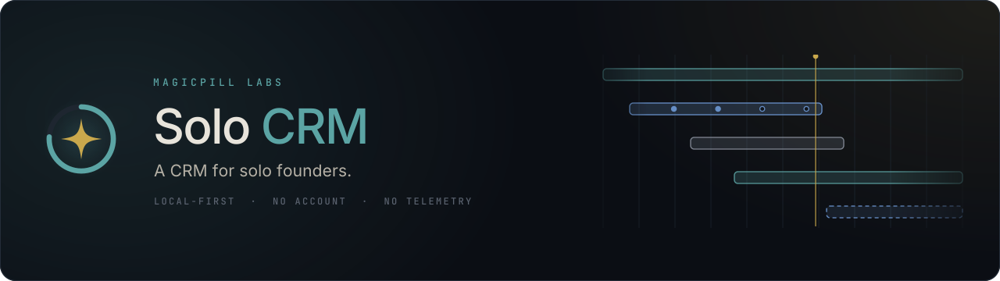

# Solo CRM

A CRM for solo founders. Client, project, contact and revenue tracking for a
one-person consultancy — local-first, no account, no server, no telemetry.

**Status:** the spine is in. Repositories over the real schema, typed IPC,
FTS5 search, the create sheets and every list and detail view; a command
palette, a quick log, a read-only SQL console channel, and a branded Windows
installer; offerings, and engagements sold from them; revenue lines
generated from each engagement's terms, rolled up three ways on a Revenue
page with a twelve-month chart. Not yet built: the integrations (P4) —
Stripe is what turns a projected line into a paid one — and the timelog
import that every hours-used figure depends on.

## Why

Existing CRMs are built around a sales pipeline — a funnel of deals that close.
That is the wrong centre of gravity for a solo services business, where revenue
is a small number of relationships that either stay warm or quietly go cold, and
where the same client can be a billing party, a delivery partner and a referral
source at once.

Solo CRM tracks the state of every relationship against a cadence you set per
company, rolls revenue up by who pays *and* by who the work is for, and links
out to Notion, Drive and Stripe rather than becoming a fourth copy of them.

## Planning

| Document | What it covers |
|---|---|
| [Requirements](planning/solo-crm-requirements.md) | Problem, goals, data model, functional and non-functional requirements |
| [Task plan](planning/solo-crm-taskplan.md) | Phased tasks with dependencies and acceptance criteria |
| [Mockup](planning/solo-crm-mockup.html) | Interactive UI mockup — open it in a browser |
| [Agent instructions](AGENTS.md) | Stack, gotchas and references for coding agents (`.claude/rules/` holds the UI design principles) |

## Stack

| Layer | Choice |
|---|---|
| Shell | Electron — Windows today (NSIS installer + portable); Ubuntu / macOS are the requirements' targets, not yet built |
| Renderer | React + Vite + TypeScript |
| Data | better-sqlite3 in the main process, WAL |
| ORM / migrations | Drizzle |
| Server state | TanStack Query over a typed IPC bridge |
| Search | SQLite FTS5 |

## Cutting a release

The version in `package.json` is hand-bumped, and it is the only place a
release gets its number. Nothing derives it from the commit, the date or the
tag count — so the bump is a deliberate step, and forgetting it fails the build
rather than overwriting the last installer.

1. Run the checks — `npm run typecheck`, `npm run lint`, `npm test`, and
   `npm run check:index` last. The `verify` skill in `.claude/skills/` runs
   these — plus migrations against a fresh and an existing database for a
   `db/` diff, and `npm run snap` for a `renderer/` one — and reports what
   actually passed. `npm run dist` runs none of
   them, so nothing else stops an unbuildable tree from being packaged, or a
   month `INDEX.md` that disagrees with its task files from shipping.
2. Bump `version` in `package.json` and commit. Semver, three numeric parts —
   NSIS needs a numeric `FileVersion`, so no `-rc.1` or `+sha` suffixes.
3. `npm run dist`.

That writes two artifacts into `release/`, both unsigned, both carrying the
version in the file name:

| Artifact | What it is | Where its data lives |
|---|---|---|
| `Solo CRM-Setup-<version>.exe` | The NSIS installer, and the default recommendation. Its version is what Windows shows in **Apps and features**, and what the installer's maintenance page compares against an existing install to offer *Update* rather than *Repair*. | `app.getPath('userData')`, or wherever `data-location.json` points |
| `Solo CRM-Portable-<version>.exe` | One file to copy onto a USB stick — no installation, nothing left behind in Program Files or the registry. | The folder the `.exe` itself sits in: `solocrm.db` lands beside it |

**The two do not share a database.** An installed copy and a portable copy on
one machine are two separate workspaces, and nothing merges them.

The portable build's costs are deliberate and recorded in
[ADR-013](.dev/decisions/ADR-013-portable-data-root.md): it extracts the whole
410 MB unpacked app into `%TEMP%` on every launch and deletes it on exit, so it
starts slower than the installed build — slower still off a USB 2.0 stick. Its
data root cannot be moved either: there is no pointer file and no settings UI
for it, and moving the data means moving the `.exe`. Do not leave that `.exe`
in a OneDrive, Dropbox or iCloud folder — the database beside it would become a
synced file, and the app refuses to start rather than let a sync daemon corrupt
it.

**The overwrite guard.** `npm run dist` runs `scripts/release-version.mjs check`
before packaging and `… record` after. `record` stamps
`release/build-manifest.json` with the version, the commit and the timestamp;
`check` refuses to build when *either* artifact for the current version is
already there and was built from a *different* commit. Rebuilding the same commit is
allowed and overwrites its own output. If the guard stops you, the fix is step 2
— not deleting the file.

**`release/latest.yml` is not an update feed.** electron-builder writes it for
the `nsis` target, and there is no auto-update wired to read it. Treat it as
incidental build output rather than a published manifest — and do not treat its
absence as a failed build: it has been observed missing from an otherwise
successful `nsis` + `portable` build, for reasons never established, and
nothing depends on it.

## Brand assets

| File | Use |
|---|---|
| [`assets/solocrm-banner.svg`](assets/solocrm-banner.svg) | Repository header (`.png` alongside it for anywhere SVG is not accepted) |
| [`assets/solocrm-logo.svg`](assets/solocrm-logo.svg) | Horizontal lockup |
| [`assets/solocrm-mark.svg`](assets/solocrm-mark.svg) | Mark alone — also the source for application icons |

The mark is a cadence ring — verdigris, carrying the gap that means a
relationship is going quiet — closed around the MagicPill Labs sparkle. Colour
follows the "Refined Alchemy" system: obsidian ground, verdigris as the working
accent, gold reserved for the one hero value in view.

---

MagicPill Labs · internal tooling
